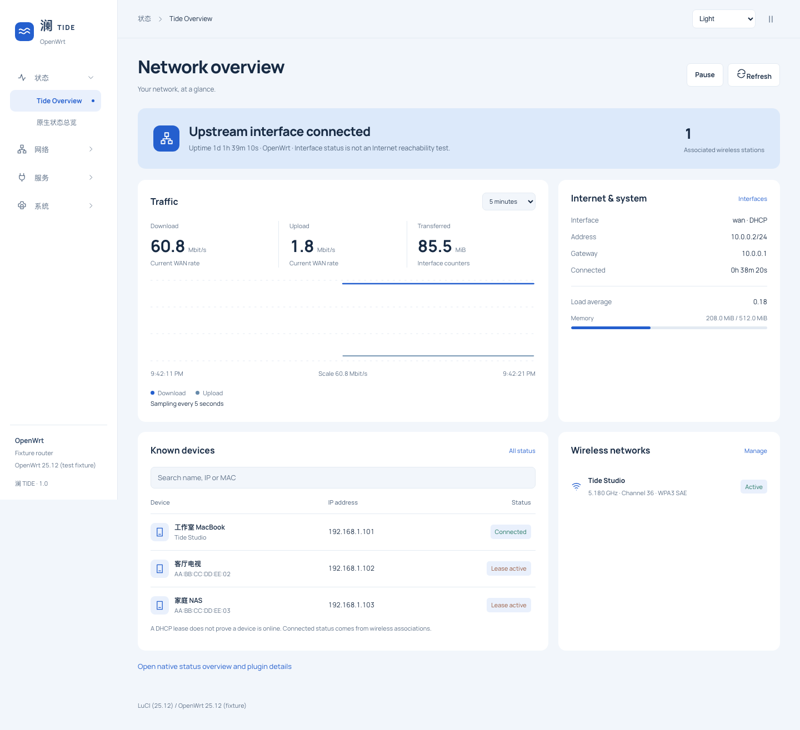
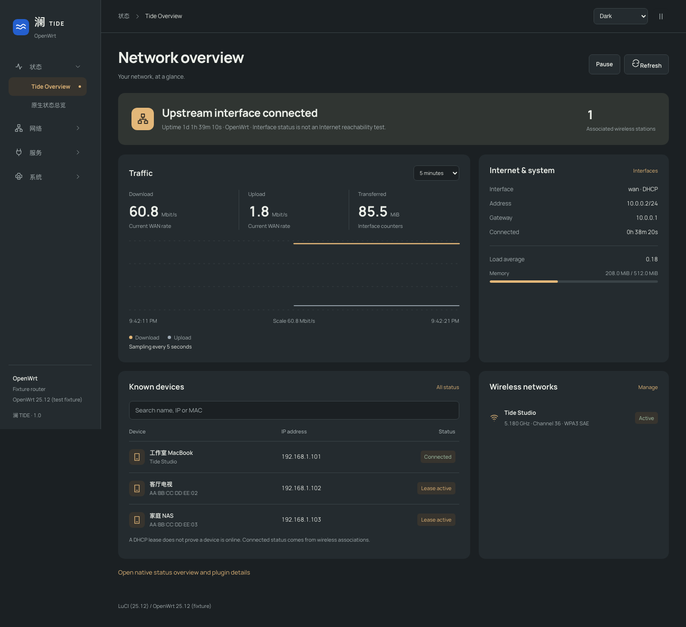

# 澜 TIDE

面向 **OpenWrt 25.12 / ucode LuCI** 的主题。浅色为海蓝，深色为石墨与琥珀，两种模式共享同一布局。视觉依据为[已确认的设计规范](docs/TIDE-DESIGN.md)。

包含可滚动的多级侧栏、浏览器保存的浅色 / 深色 / 跟随系统偏好、手机导航、登录页、LuCI 表单 / tabs / 表格 / 下拉控件 / 模态框样式，以及真实数据驱动的澜总览。

截图来自实际主题代码的本地测试页面，RPC 与设备数据为测试夹具，不代表真实路由器运行状态。

## 安装与启用

GitHub Actions 的 **OpenWrt 25.12 package** 工作流使用官方 SDK 构建主题和中文翻译。运行成功后，在对应运行的 Artifacts 下载 **luci-theme-tide-openwrt-25.12** 并解压。主题包架构为 all。

OpenWrt 25.12 使用 APK；在路由器上安装下载的包：

~~~sh
apk add --allow-untrusted ./luci-theme-tide-1.0.0-r1.apk
apk add --allow-untrusted ./luci-i18n-tide-zh-cn-*.apk
~~~

请使用产物中的实际文件名；翻译包版本由 LuCI 构建规则生成。--allow-untrusted 用于安装自行构建、未由官方仓库签名的包。

安装只注册主题。进入 **系统 → 系统 → 语言和界面**，选择 **Tide** 并保存应用。也可运行：

~~~sh
uci set luci.main.mediaurlbase='/luci-static/tide'
uci commit luci
~~~

刷新浏览器后，在 **状态 → 澜总览** 查看新的总览。原生 **状态 → 总览** 保留，用于详细状态、存储、端口、DSL 和插件扩展信息。主题不会改变设备网络配置，也不会替换 LuCI 核心文件。

外观选项和暂停动效按当前浏览器保存。清除站点数据后恢复跟随系统；系统的“减少动态效果”偏好始终生效。

切回原主题：

~~~sh
uci set luci.main.mediaurlbase='/luci-static/bootstrap'
uci commit luci
~~~

请在卸载 Tide 前选择另一已安装的主题；卸载脚本也会将当前 Tide 选择回退到 Bootstrap。

## 总览的数据含义

- 上行连接状态来自 LuCI 网络模型，不进行互联网连通性探测。
- 下载 / 上传速率由 WAN 设备计数器差分计算。同一设备的 IPv4 / IPv6 上行不会重复计数；接口切换、计数器重置、请求失败和采样间隔过长会中断曲线。
- 流量历史从页面打开后开始，最多保留 10 分钟。初始阶段显示采样提示，不生成过去的数据。
- 内存来自 system.info；负载显示 load average，不将它伪装成 CPU 使用率。
- 无线关联设备数来自实际关联列表。DHCP 租约仅表示租约有效，不能证明设备在线。
- DHCP 与无线关联信息遵循 LuCI 原有访问权限。请求失败保留上次数据，标记过期并提供重试；主题不扩大 ACL。

无线配置、接口修改与保存 / 应用 / 回滚仍由原生 LuCI 页面处理。总览的管理入口跳转到这些页面。

## 从源码构建

在 OpenWrt 25.12 源码树或对应 SDK 中：

~~~sh
git clone https://github.com/yefanZh/luci-theme-tide.git package/luci-theme-tide
./scripts/feeds update luci
./scripts/feeds install -a -p luci
make menuconfig
# LuCI → Themes → luci-theme-tide；需要中文时同时选择 tide 的中文翻译
make package/luci-theme-tide/compile V=s
~~~

产物位于 bin/packages/。运行时仅打包 htdocs/、ucode/、root/ 以及所选翻译；Node、测试夹具和设计资料不进入路由器。

## 开发与验证

~~~sh
npm ci
npm test
~~~

浏览器测试使用原生 ucode 渲染正式模板，并使用 OpenWrt 25.12 的真实 LuCI DOM 工具，菜单、RPC 和采样数据为明确的 mock：

~~~sh
git clone --depth 1 --branch openwrt-25.12 https://github.com/openwrt/luci.git /tmp/tide-luci
npx playwright install chromium
export UCODE_BIN=/path/to/ucode
export LUCI_REFERENCE=/tmp/tide-luci
npm test
npm run test:browser
npm run preview
# http://127.0.0.1:8098（测试数据）
~~~

可用 CHROMIUM_EXECUTABLE 指定已有 Chromium。未设置 UCODE_BIN 时，基础测试会明确跳过模板渲染；浏览器测试必须具备 ucode。GitHub 的 Theme checks 工作流会构建 ucode 并运行全部检查。

已完成的本地检查及真实设备验收边界见[验证记录](docs/VALIDATION.md)。本项目目前以 25.12 为适配目标，不声明旧版 Lua LuCI、第三方固件或所有插件已经通过实机验收。

## 授权

主题为 Apache-2.0；LuCI Bootstrap 的控件兼容样式保留上游授权和署名，详见 [NOTICE](NOTICE)。自托管 Manrope 字体采用 SIL OFL 1.1，许可证随字体分发。页面不加载外部字体或 CDN。
