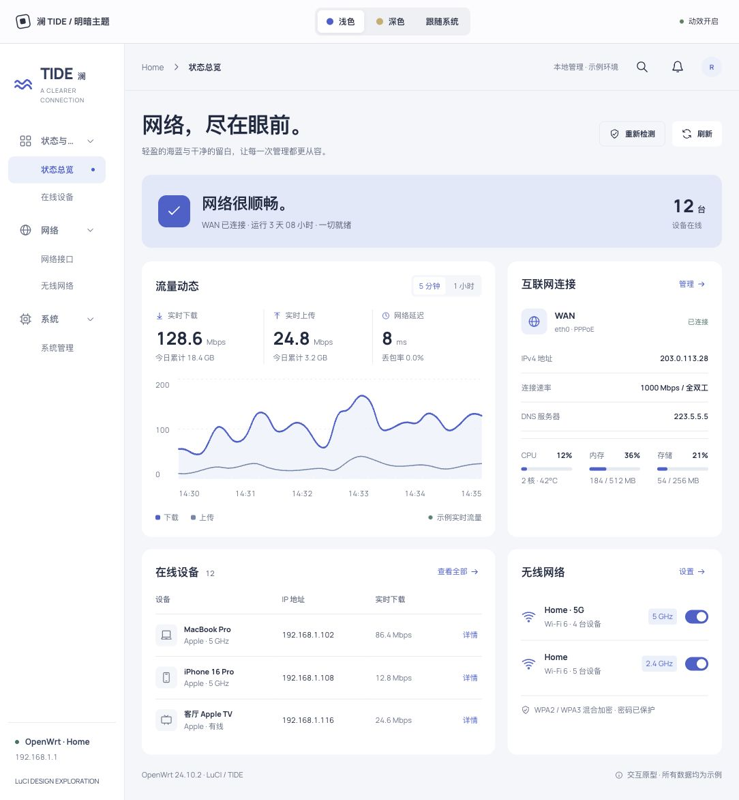
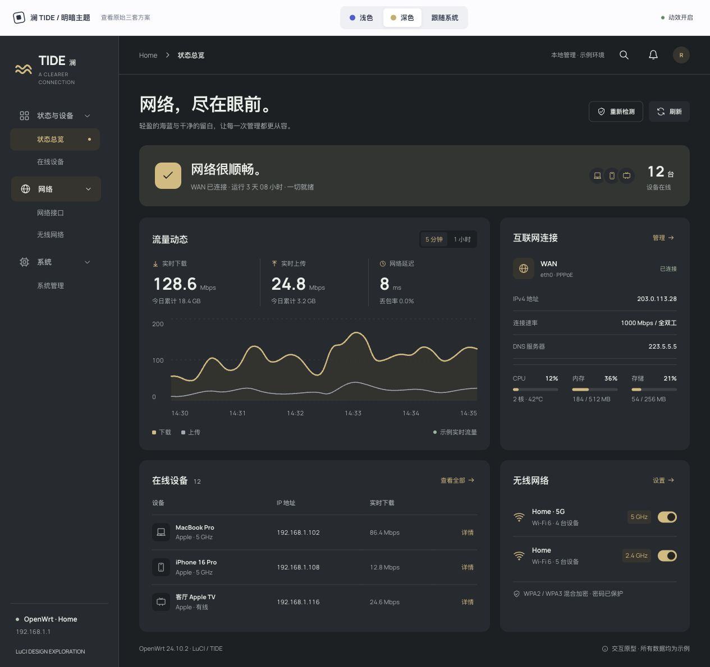

# 澜 TIDE · OpenWrt LuCI 主题设计规范

版本：1.0 · 2026-10-04 · 状态：用户已选定视觉方向，供主题开发使用。

## 1. 已确认的设计决定

采用 **澜 TIDE 的整体布局**。浅色使用澜的海蓝配色，深色使用曜 NOCT 的石墨与琥珀配色。明暗模式的导航、内容顺序、尺寸、圆角、网格和操作位置完全一致。

用户选择侧边栏的原因是现实中的 LuCI 会有很多菜单、插件和页面。因此，侧边栏是长期保留的主体结构，设计必须容纳大量导航项和多级菜单。

动效是主题的重要组成部分：点击有反馈，页面切换有过渡，请求有加载状态，图表有绘制过程，菜单和详情抽屉有展开与关闭过程。所有动效围绕实际操作发生。

这份文档记录选定的设计及开发规则。当前 HTML 是交互原型，所有网络数据均为示例。真实 LuCI 的版本适配、插件页面兼容和安装包开发尚未完成。

配套文件：

- `tide.html`：选定方案的确认原型，支持浅色、深色、跟随系统。
- `tide-theme.css`：完整、可编辑的选定主题样式，含响应式与动效。
- `tide-motion.css`：从本规范提取的独立动效参考，可单独查看；完整版样式已包含它的规则。
- `app.js`：原型的状态切换与交互逻辑；用于理解触发时机，不是可直接安装的 LuCI 脚本。
- `assets/manrope-latin.ttf` 与 `assets/OFL-Manrope.txt`：自托管字体和许可证。

### 确认原型的明暗预览





## 2. 整体视觉语言

空间清楚，信息有层级。主体由左侧导航、顶部上下文栏和内容区域组成。页面先交代网络状态，再给出流量与接口信息，最后展示设备和无线网络。

浅色像一张干净的网络工作台；深色像同一张工作台在夜间的状态。深色保留澜的排布，强调色改为柔和的琥珀，主体文字保持中性浅色。

面板使用色面区分层级。主要面板不使用大面积投影。阴影只用于真正浮起的元素，如详情抽屉、提示消息和分段选项。

## 3. 明暗配色与完整变量

### 3.1 颜色映射

| CSS 变量 | 浅色 | 深色 | 使用位置 |
|---|---|---|---|
| `--bg` | `#f2f6fb` | `#1b2023` | 工作区背景 |
| `--panel` | `#ffffff` | `#242b2f` | 面板、输入背景层与详情抽屉 |
| `--ink` | `#172a43` | `#ecefe9` | 标题、主要数值、正文 |
| `--muted` | `#5e7087` | `#a6b0b2` | 辅助说明、单位、表头、次级导航 |
| `--line` | `#e3eaf2` | `#3a4347` | 细分隔线、边框、资源条底轨 |
| `--accent` | `#245fce` | `#e3b779` | 当前导航、主按钮、下载曲线、开关 |
| `--soft` | `#e9f0fc` | `#37342e` | 选中背景、图标底色、图表面积 |
| `--success` | `#217660` | `#a6c8ac` | 正常、连接成功、健康状态 |
| `--side` | `#ffffff` | `#242b2f` | 侧边栏背景 |
| `--side-ink` | `#263f60` | `#ecefe9` | 侧边栏品牌及主要文字 |
| `--on-accent` | `#ffffff` | `#282521` | 主按钮、开启开关上的文字或图形 |
| `--hero` | `#dce9fa` | `#303532` | 总览连接状态横幅 |
| `--hero-muted` | `#4e627a` | `#a6b0b2` | 横幅内辅助文字 |
| `--chart-secondary` | `#668aaa` | `#9eaab4` | 上传曲线及图例 |
| `--error` | `#a7463d` | `#eea29a` | 表单错误与错误边框 |
| `--danger` | `#a7463d` | `#eea29a` | 删除、危险操作的文字与边框 |

浅色上传曲线和横幅辅助文字已经按可读性加深；不继续使用早期原型中的过浅上传蓝。深色的错误文字单独提高亮度。

### 3.2 可直接使用的 CSS

```css
:root {
  --font: Manrope, -apple-system, BlinkMacSystemFont,
          "PingFang SC", "Microsoft YaHei", sans-serif;
  --bg: #f2f6fb;
  --panel: #ffffff;
  --ink: #172a43;
  --muted: #5e7087;
  --line: #e3eaf2;
  --accent: #245fce;
  --soft: #e9f0fc;
  --success: #217660;
  --side: #ffffff;
  --side-ink: #263f60;
  --on-accent: #ffffff;
  --hero: #dce9fa;
  --hero-muted: #4e627a;
  --chart-secondary: #668aaa;
  --error: #a7463d;
  --danger: #a7463d;
  --radius: 14px;
  --ease: cubic-bezier(.16, 1, .3, 1);
  --duration: 450ms;
  /* 仅用于原型顶部的比较工具条；真实 LuCI 设置为 0px。 */
  --previewbar: 64px;
}

.theme-tide { color-scheme: light; }

.theme-tide.dark {
  color-scheme: dark;
  --bg: #1b2023;
  --panel: #242b2f;
  --ink: #ecefe9;
  --muted: #a6b0b2;
  --line: #3a4347;
  --accent: #e3b779;
  --soft: #37342e;
  --success: #a6c8ac;
  --side: #242b2f;
  --side-ink: #ecefe9;
  --on-accent: #282521;
  --hero: #303532;
  --hero-muted: #a6b0b2;
  --chart-secondary: #9eaab4;
  --error: #eea29a;
  --danger: #eea29a;
}

body { background: var(--bg); color: var(--ink); }
.panel { background: var(--panel); }
.hero { background: var(--hero); }
.hero p { color: var(--hero-muted); }
.btn.primary { background: var(--accent); color: var(--on-accent); }
.field-error { color: var(--error) !important; }
.field.invalid input { border-color: var(--error); }
.btn.danger { color: var(--danger); border-color: var(--danger); }
```

### 3.3 状态色规则

正常状态使用 `--success`，当前选择和普通动作使用 `--accent`。断网、暂停和失败必须有文字说明，不能只靠颜色表达。

警告与“暂停”的浅色文字使用 `#a66445`，深色使用琥珀；错误和危险操作使用上表中的独立变量。正式开发中的警告色需要在其实际背景上复核文字对比度。

图表下载与上传除了色彩不同，线宽也不同：下载 2.6px，上传 1.6px。两者都保留文字图例。

## 4. 整体布局和尺寸

### 4.1 页面骨架

```text
┌─────────────────────────────────────────────────────────────────┐
│ 原型比较工具条（64px；正式 LuCI 中移除）                            │
├───────────────┬─────────────────────────────────────────────────┤
│ 品牌 / 设备名  │ 上下文栏：面包屑、搜索、事件、账户（69px）             │
│               ├─────────────────────────────────────────────────┤
│ 可滚动菜单     │ 页面标题                              刷新 / 操作 │
│ 状态          │                                                 │
│   总览        │ 网络健康横幅：状态、运行时长、在线设备数量            │
│   设备        │                                                 │
│ 网络          │ ┌───────────────────┐ ┌─────────────────────┐   │
│   接口        │ │ 流量与图表         │ │ 互联网接口、系统资源   │   │
│   无线        │ └───────────────────┘ └─────────────────────┘   │
│ 系统 / 插件…  │ ┌───────────────────┐ ┌─────────────────────┐   │
│               │ │ 在线设备           │ │ 无线网络             │   │
│               │ └───────────────────┘ └─────────────────────┘   │
│ 固定设备信息   │ 固件信息 / 页脚                                   │
└───────────────┴─────────────────────────────────────────────────┘
```

侧边栏始终位于左侧。品牌区域与底部设备信息固定在侧边栏内，只有中间的菜单独立滚动。主页面正常纵向滚动。

### 4.2 尺寸表

| 对象 | 桌面基准 | 较窄窗口 | 手机 |
|---|---|---|---|
| 侧边栏宽度 | 212px | ≤1200px 为 183px；≤980px 为 155px | 收起；展开为 220px |
| 上下文栏高度 | 69px | 69px | 57px |
| 内容左右留白 | 36px | ≤1200px 为 25px；≤980px 为 22px | 17px |
| 内容顶部留白 | 31px | 28px / 25px | 24px |
| 内容最大宽度 | 1560px | 随窗口缩小 | 100% |
| 总览两列比例 | 1.85 : 1 | ≤1200px 为 1.65 : 1；≤980px 单列 | 单列 |
| 总览面板间距 | 18px | 18px | 16px |
| 普通面板内边距 | 23px | ≤1200px 为 20px | 20px 17px |
| 面板圆角 | 14px | 14px | 横幅 12px，普通面板 14px |
| 一级导航行高 | 至少 45px | 同左 | 同左 |
| 二级导航行高 | 至少 39px | 同左 | 建议触摸环境提升至 44px |
| 详情抽屉宽度 | 385px | 同左 | 最大 91vw |

≥1600px 时内容顶部留白增加至 40px、面板内边距为 27px、图表高度为 175px。明暗模式共用全部尺寸。

### 4.3 布局 CSS

```css
.shell {
  display: grid;
  grid-template-columns: 212px minmax(0, 1fr);
  min-height: calc(100dvh - var(--previewbar));
}
.workspace { min-width: 0; }
.topbar {
  height: 69px;
  padding: 0 36px;
  display: flex;
  align-items: center;
  justify-content: space-between;
  border-bottom: 1px solid var(--line);
}
.content {
  padding: 31px 36px 24px;
  max-width: 1560px;
  margin: auto;
  min-width: 0;
}
.page-heading {
  display: flex;
  justify-content: space-between;
  align-items: center;
  gap: 18px;
  margin-bottom: 25px;
}
.hero {
  display: grid;
  grid-template-columns: minmax(0, 1fr) auto;
  align-items: center;
  gap: 24px;
  padding: 25px 28px;
  margin-bottom: 20px;
  border-radius: var(--radius);
  background: var(--hero);
}
.overview-grid, .lower-grid {
  display: grid;
  grid-template-columns: minmax(0, 1.85fr) minmax(260px, 1fr);
  gap: 18px;
}
.overview-grid { margin-bottom: 18px; }
.panel {
  background: var(--panel);
  border-radius: var(--radius);
  padding: 23px;
  min-width: 0;
}
.settings-layout {
  display: grid;
  grid-template-columns: minmax(0, 1.7fr) minmax(240px, 1fr);
  gap: 20px;
}
.form-row {
  display: grid;
  grid-template-columns: 155px minmax(0, 1fr);
  gap: 18px;
  align-items: start;
  padding: 21px 0;
  border-bottom: 1px solid var(--line);
}
```

顶部原型工具条用于比较、明暗选择与暂停动效。它不属于正式路由器主题。接入 LuCI 时，移除 `.labbar`，并在所有断点将 `--previewbar` 设置为 `0px`。

## 5. 长侧边栏、多级菜单和大量插件

### 5.1 信息结构

正式 LuCI 按真实菜单树生成一级分组，例如状态、系统、服务、网络、存储等。每个分组包含其二级页面，插件追加到已有的分组中。原型只展示五个可操作页面，正式菜单项数量不得硬编码。

一级分组由图标、名称和展开箭头组成。二级页面不重复图标，用缩进表达从属关系。更深层级每层追加 16px 缩进；不要让多个层级看起来一样。

允许多个分组同时展开。当前页面对应的父级自动展开，切换页面后保留其他分组的展开状态和菜单滚动位置。

长标题单行省略，完整名称提供给可访问名称；桌面可通过 title 或轻量 tooltip 查看。菜单宽度不能跟随标题变化。

### 5.2 侧边栏 CSS

```css
.sidebar {
  position: sticky;
  top: var(--previewbar);
  height: calc(100dvh - var(--previewbar));
  display: flex;
  flex-direction: column;
  gap: 30px;
  padding: 31px 18px 20px;
  overflow: hidden;
  color: var(--side-ink);
  background: var(--side);
  border-right: 1px solid var(--line);
}
.sidebar .brand, .sidebar-bottom { flex-shrink: 0; }
.sidebar .nav {
  min-height: 0;
  overflow-y: auto;
  overscroll-behavior: contain;
  scrollbar-gutter: stable;
}
.sidebar-bottom { margin-top: auto; }
.nav button {
  display: flex;
  align-items: center;
  gap: 13px;
  min-height: 45px;
  padding: 10px 16px;
  border-radius: 9px;
  color: var(--muted);
  transition: background 200ms, color 200ms, transform 180ms;
}
.nav button:hover {
  background: var(--soft);
  color: var(--ink);
  transform: translateX(2px);
}
.nav button[aria-current="page"] {
  color: var(--accent);
  background: var(--soft);
  font-weight: 700;
}
.nav button span {
  min-width: 0;
  overflow: hidden;
  white-space: nowrap;
  text-overflow: ellipsis;
}
.nav-children {
  display: grid;
  grid-template-rows: 1fr;
  transition: grid-template-rows 320ms var(--ease);
}
.nav-group.collapsed .nav-children { grid-template-rows: 0fr; }
.nav-children-inner { min-height: 0; overflow: hidden; }
.nav-children button {
  width: 100%;
  min-height: 39px;
  padding-left: 48px;
  font-size: 12px;
}
.group-chevron {
  margin-left: auto;
  width: 13px;
  height: 13px;
  transform: rotate(90deg);
  transition: transform 300ms var(--ease);
}
[aria-expanded="false"] .group-chevron { transform: rotate(0); }
```

当前页面使用 `aria-current="page"`。分组按钮使用 `aria-expanded` 与 `aria-controls`。收起的菜单内容设为 `inert`，避免键盘焦点进入看不见的内容。

独立滚动和折叠已在确认原型中实现。真实菜单树、更多层级、路径匹配、菜单位置持久化和插件列表需要在 LuCI 主题开发时接入。原型的手机菜单已限制背景交互，但完整的循环焦点限制仍是正式开发验收项。

## 6. 字体、组件与状态

### 6.1 字体与图标

西文及数字使用自托管 Manrope；中文使用 PingFang SC / Microsoft YaHei / 系统无衬线。字体加载失败时完整回退，不依赖外部字体服务。

| 角色 | 大小 / 字重 | 规则 |
|---|---|---|
| 页面标题 | 32px / 750 | 行高 1.3，字距 −0.03em |
| 手机标题 | 26px / 750 | 长标题换行，不盖住操作按钮 |
| 面板标题 | 16px / 700 | 手机 14px |
| 主体正文 | 13px / 400 | 行高 1.6 |
| 导航 | 13px；二级 12px | 当前页面 700 |
| 主要指标 | 30px / 700 | 手机 25px，单位 11px |
| 辅助说明、表头、单位 | 至少 11px | 不将低于 11px 的字号用于功能信息 |

全局设置 `font-variant-numeric: tabular-nums`，避免更新中的数字左右晃动。图标使用同一套线性 SVG：默认 19×19px、描边 1.65px、圆形端点。不要混用 emoji 与不同描边风格。

### 6.2 组件 CSS

```css
body {
  margin: 0;
  font: 13px/1.6 var(--font);
  font-variant-numeric: tabular-nums;
  -webkit-font-smoothing: antialiased;
}
.btn {
  min-height: 37px;
  padding: 8px 14px;
  display: inline-flex;
  align-items: center;
  justify-content: center;
  gap: 8px;
  border-radius: 7px;
  font-weight: 650;
  background: var(--panel);
  transition: background 200ms, transform 180ms, box-shadow 200ms;
}
.btn:hover { background: var(--soft); transform: translateY(-1px); }
.btn:active { transform: scale(.97); }
.btn.primary { background: var(--accent); color: var(--on-accent); }
.btn.primary:hover { filter: brightness(1.08); }
.btn.outline { border: 1px solid var(--line); background: transparent; }
button:disabled { opacity: .55; cursor: wait; }
input, select {
  width: 100%;
  min-height: 39px;
  padding: 9px 12px;
  border: 1px solid var(--line);
  border-radius: 7px;
  background: var(--bg);
  color: var(--ink);
  caret-color: var(--accent);
  transition: border-color 200ms, background 200ms;
}
button:focus-visible, a:focus-visible,
input:focus-visible, select:focus-visible {
  outline: 3px solid var(--accent);
  outline-offset: 4px;
}
::selection { background: var(--accent); color: var(--on-accent); }
.switch {
  width: 34px;
  height: 20px;
  padding: 3px;
  flex-shrink: 0;
  border-radius: 12px;
  background: var(--line);
  transition: background 200ms;
}
.switch span {
  display: block;
  width: 14px;
  height: 14px;
  border-radius: 50%;
  background: var(--panel);
  box-shadow: 0 1px 3px #0002;
  transition: transform 350ms var(--ease);
}
.switch[aria-checked="true"] { background: var(--accent); }
.switch[aria-checked="true"] span {
  transform: translateX(14px);
  background: var(--on-accent);
}
```

表格头部细线分隔，设备名称在左、操作在右；IP 地址使用对齐数字。列表不整行跳动。空列表保留筛选条件，显示原因和“清除筛选”。原型已演示设备搜索空状态。

开关视觉宽度为 34px，高度为 20px。正式手机适配时应通过外层 label 或容器扩展至至少 44×44px 的可点击范围，保持开关本身尺寸。

## 7. 动效设计与可复制 CSS

### 7.1 动效时序表

| 动作 | 触发 | 时间 | 效果 | 打断与降级 |
|---|---|---|---|---|
| 明暗切换 | 点击浅色、深色、自动 | 560ms | 从点击位置向外展开新配色 | 新切换取消旧过渡；无 View Transition API 时直接切换 |
| 页面退出 | 点击另一个菜单项 | 100ms | 上移 6px、透明度下降 | 新导航只保留最后一个目标 |
| 页面进入 | 新内容已准备好 | 450ms | 上移入位、透明与轻微模糊恢复 | 快速再次导航不阻塞 |
| 菜单分组 | 点击一级分组 | 320ms | 子菜单高度平滑收展 | 从当前高度继续反向过渡 |
| 分组箭头 | 同上 | 300ms | 0° ↔ 90° | 与分组状态同步 |
| 点击波纹 | 点击按钮 | 580ms | 从点击位置扩展后消失 | 每个波纹独立结束并删除 |
| 点击粒子 | 主按钮 / 明暗控制 | 520ms | 五个小粒子短距离散开 | 降低动态效果时省略 |
| 按钮 hover / active | 悬停 / 按下 | 180–200ms | 上移 1px / 缩放 .97 | 松开立即回到当前状态 |
| 开关拨动 | 切换无线 / 动效 | 350ms | 圆点水平移动 14px | 原生状态立即更新 |
| 图表绘制 | 首次显示 / 更换时间范围 | 1000ms | 描边逐段显现 | 周期数据刷新不重放整段 |
| 资源条进入 | 首次显示 | 850ms | 从零扩展到实际占用比例 | 常规更新只插值到新比例 |
| 刷新加载 | 发起数据请求 | 持续到完成 | 顶部进度、骨架光带或按钮 spinner | 请求失败要进入错误状态 |
| 详情抽屉打开 | 点击设备 | 450ms | 从右侧移入 | Escape、遮罩、关闭按钮可关闭 |
| 详情抽屉关闭 | 点击关闭 / Escape | 220ms | 向右退出后移除 | 关闭后恢复触发元素焦点 |
| 手机菜单打开 | 点击菜单 | 350ms | 从左侧移入 | 可由关闭、遮罩、Escape、选页结束 |
| 提示消息 | 保存、开关、刷新完成 | 380ms 进入；3.2s 后隐藏 | 底部轻移入位 | 新提示替换旧内容 |

原型的刷新等待为 700ms，连接检测为 650ms；保存分成约 380ms 的校验和 480ms 的应用阶段。这些时间用来展示反馈，真实 LuCI 必须由请求结果驱动。

### 7.2 页面、点击和图表动效

```css
.page-enter { animation: page-in 450ms var(--ease); }
.page-leave { animation: page-out 100ms ease-in both; }
@keyframes page-in {
  from { opacity: .45; transform: translateY(12px); filter: blur(2px); }
  to   { opacity: 1; transform: translateY(0); filter: blur(0); }
}
@keyframes page-out {
  to { opacity: .15; transform: translateY(-6px); }
}

button { position: relative; isolation: isolate; }
.ripple {
  position: absolute;
  z-index: -1;
  border-radius: 50%;
  background: currentColor;
  pointer-events: none;
  animation: ripple 580ms var(--ease) forwards;
}
@keyframes ripple {
  from { transform: scale(0); opacity: .16; }
  to   { transform: scale(1); opacity: 0; }
}
.click-burst {
  position: fixed;
  z-index: 180;
  width: 4px;
  height: 4px;
  border-radius: 50%;
  background: var(--accent);
  pointer-events: none;
  animation: burst 520ms var(--ease) forwards;
}
@keyframes burst {
  from { transform: translate(0, 0); opacity: .8; }
  to   { transform: translate(var(--dx), var(--dy)); opacity: 0; }
}

.chart-line {
  fill: none;
  stroke: var(--accent);
  stroke-width: 2.6;
  stroke-linecap: round;
  stroke-linejoin: round;
  stroke-dasharray: 1400;
  stroke-dashoffset: 0;
  animation: trace 1000ms var(--ease);
}
.chart-line.secondary { stroke: var(--chart-secondary); stroke-width: 1.6; }
@keyframes trace {
  from { stroke-dashoffset: 1400; }
  to   { stroke-dashoffset: 0; }
}
.meter span {
  display: block;
  width: var(--value);
  height: 100%;
  border-radius: 4px;
  background: var(--accent);
  animation: meter 850ms var(--ease);
}
@keyframes meter {
  from { width: 0; }
  to   { width: var(--value); }
}
```

波纹的尺寸和位置由 JS 注入，直径为按钮长边的约 1.8 倍，中心放在点击处。580ms 后删除节点。原型粒子的五个方向均匀分布，每个移动约 24px，560ms 后清理。正式主题中不要给纯文本、表格空白或每次数据更新都生成粒子。

图表固定长度 1400 是原型示例。真实曲线应调用 `path.getTotalLength()`，避免不同图形绘制速度不一致。

### 7.3 明暗模式的点击位置展开

```css
::view-transition-old(root), ::view-transition-new(root) {
  animation-duration: 560ms;
  animation-timing-function: var(--ease);
}
::view-transition-old(root) { animation: none; }
::view-transition-new(root) { animation-name: theme-reveal; }
@keyframes theme-reveal {
  from { clip-path: circle(0 at var(--click-x, 50%) var(--click-y, 0)); }
  to   { clip-path: circle(160vmax at var(--click-x, 50%) var(--click-y, 0)); }
}
```

原型通过 `document.startViewTransition()` 配合 `--click-x` / `--click-y` 实现。正式接入时只改变根节点主题类或变量；保留现有 DOM、表单、滚动位置、当前页和焦点。不要为了换颜色重新创建页面。

### 7.4 加载与请求反馈

```css
.spinner, .loading-button .icon { animation: spin 800ms linear infinite; }
@keyframes spin { to { transform: rotate(360deg); } }
.skeleton {
  position: relative;
  height: 14px;
  overflow: hidden;
  border-radius: 5px;
  background: var(--line);
}
.skeleton::after {
  content: "";
  position: absolute;
  inset: 0;
  background: linear-gradient(90deg, transparent, #ffffff28, transparent);
  animation: shimmer 1200ms ease infinite;
}
@keyframes shimmer {
  from { transform: translateX(-100%); }
  to   { transform: translateX(100%); }
}
.loadline {
  position: fixed;
  left: 0;
  top: var(--previewbar);
  z-index: 150;
  width: 100%;
  height: 2px;
  background: var(--accent);
  transform: scaleX(0);
  transform-origin: left;
}
.loadline.loading { animation: load 800ms var(--ease) forwards; }
@keyframes load {
  0%   { transform: scaleX(0); }
  65%  { transform: scaleX(.78); }
  100% { transform: scaleX(1); }
}
```

上面的进度条是原型展示版。正式请求不能在未完成时显示 100%。实现规则：等待阶段最多到 78%，收到成功结果后才到 100%，随后收起；失败显示错误原因和重试。短请求不强行加入 700ms 延迟。

首次加载使用骨架；后台更新保留旧数据和布局，只显示局部加载状态。请求期间锁定提交按钮和正在提交的表单，导航保持可操作。后台轮询不重复触发页面进入动效。

### 7.5 抽屉、提示消息与菜单

```css
dialog {
  position: fixed;
  inset: 0 0 0 auto;
  margin: 0 0 0 auto;
  width: 385px;
  max-width: 94vw;
  height: 100dvh;
  max-height: 100dvh;
  border: 0;
  padding: 0;
  color: var(--ink);
  background: var(--panel);
  box-shadow: -12px 0 55px #0002;
}
dialog::backdrop { background: #12232142; backdrop-filter: blur(3px); }
dialog[open] { animation: drawer-in 450ms var(--ease); }
.drawer-close-animation { animation: drawer-out 220ms ease-in forwards !important; }
@keyframes drawer-in { from { transform: translateX(100%); } to { transform: translateX(0); } }
@keyframes drawer-out { to { transform: translateX(100%); } }
@keyframes nav-in { from { transform: translateX(-100%); } to { transform: translateX(0); } }

#toast {
  position: fixed;
  left: 50%;
  bottom: 29px;
  z-index: 200;
  max-width: calc(100% - 30px);
  padding: 12px 19px;
  border-radius: 9px;
  color: var(--panel);
  background: var(--ink);
  box-shadow: 0 10px 30px #0002;
  transform: translate(-50%, 30px);
  opacity: 0;
  pointer-events: none;
  transition: transform 380ms var(--ease), opacity 200ms;
}
#toast.show { opacity: 1; transform: translate(-50%, 0); }
```

关闭动画结束后再调用 `dialog.close()`，避免突然消失。使用原生 `<dialog>` 的焦点限制与 Escape 机制；关闭后恢复发起操作的焦点。提示消息使用 `role="status"`，新的消息替换旧计时器。

### 7.6 减少动态效果与性能

```css
body.motion-off *, body.motion-off *::before, body.motion-off *::after {
  animation: none !important;
  transition: none !important;
}
body.motion-off .ripple, body.motion-off .click-burst { display: none; }
body.motion-off .loadline.loading { transform: scaleX(1); }

@media (prefers-reduced-motion: reduce) {
  html { scroll-behavior: auto; }
  *, *::before, *::after {
    animation: none !important;
    transition: none !important;
  }
  .ripple, .click-burst { display: none; }
  ::view-transition-old(root), ::view-transition-new(root) { animation: none !important; }
}
```

降低动态效果时保留 loading 文字、disabled、错误与成功状态。主题类和开关仍立即更新。静态内容默认可见，不依赖 animation 才出现。页面失焦或隐藏时停止无意义的持续动画。

总览只在进入时绘制图表与资源条。点击效果不超过 5 个粒子，每次立即清理。避免对大面积布局属性持续动画；手机可省略进入阶段的 2px blur。

## 8. 页面内容和交互约定

### 8.1 状态总览

顺序固定：标题与刷新 → 健康横幅 → 流量 + 互联网接口 → 设备 + 无线网络 → 页脚。网络状态先于性能细节。

横幅给出 WAN 状态、运行时长和在线设备数。流量面板显示下载、上传、延迟、时间范围与图表。右侧接口面板显示 WAN 协议、地址、链路速率、DNS 与资源占用。

### 8.2 设备页面与详情

设备列表提供名称/IP 搜索和连接方式筛选。详情使用右侧抽屉，包含连接信息、网络活动和明确命名的操作。实时速率与在线计数由同一数据源产生。

### 8.3 设置页面

桌面左侧表单、右侧简短说明，手机保留表单并隐藏侧边说明。输入标签位于表单左列；手机改为字段上方。底部保留“恢复默认/已保存值”和“保存并应用”。

表单状态：干净 → 已修改 → 校验 → 提交 → 成功 / 失败。失败保留用户输入。主题切换不能抹掉未保存内容，提交时使用数据快照，重复提交被禁止。真实 LuCI 的“保存”“保存并应用”和回滚确认需要保留原有语义。

### 8.4 网络与日志

接口列表显示可读状态、地址、协议和速率。日志使用左侧时间、右侧事件内容，状态文字辅助识别。原型的“模拟断网”属于演示功能，正式主题中移除。

## 9. 响应式 CSS 和手机导航

```css
@media (max-width: 1200px) {
  .shell { grid-template-columns: 183px minmax(0, 1fr); }
  .content { padding: 28px 25px; }
  .topbar { padding: 0 25px; }
  .panel { padding: 20px; }
  .overview-grid, .lower-grid {
    grid-template-columns: minmax(0, 1.65fr) minmax(240px, 1fr);
  }
  .form-row { grid-template-columns: 100px minmax(0, 1fr); }
}
@media (max-width: 980px) {
  .shell { grid-template-columns: 155px minmax(0, 1fr); }
  .content { padding: 25px 22px; }
  .topbar { padding: 0 22px; }
  .overview-grid, .lower-grid, .settings-layout { grid-template-columns: minmax(0, 1fr); }
  .settings-tip, .hero-right { display: none; }
}
@media (max-width: 680px) {
  :root { --previewbar: 96px; } /* 正式 LuCI 中仍然为 0px。 */
  .shell { display: block; }
  .sidebar {
    display: none;
    position: fixed;
    top: var(--previewbar);
    left: 0;
    bottom: 0;
    width: 220px;
    z-index: 90;
    height: calc(100dvh - var(--previewbar));
    box-shadow: 8px 0 25px #0002;
  }
  .sidebar.open { display: flex; animation: nav-in 350ms var(--ease); }
  .sidebar .nav { flex: 1; }
  .menu-toggle, .nav-close { display: grid; }
  .nav-mask:not([hidden]) {
    display: block;
    position: fixed;
    inset: var(--previewbar) 0 0;
    background: #12232155;
    z-index: 85;
  }
  .topbar { height: 57px; padding: 0 18px; }
  .content { padding: 24px 17px 20px; }
  .panel { padding: 20px 17px; }
  .form-row { grid-template-columns: 1fr; gap: 7px; padding: 16px 0; }
  .overview-grid, .lower-grid { gap: 16px; }
  dialog { max-width: 91vw; }
}
```

手机展开菜单时提供侧栏内的关闭按钮，遮罩点击、Escape 和选择页面都能关闭。触发按钮同步 `aria-expanded`，使用 `aria-controls="mainmenu"`。背景工作区设为 `inert`，关闭后恢复可操作和菜单按钮焦点。

表格如果需要完整字段，允许在表格容器内横向滚动，不能让整页横向溢出。原型手机总览隐藏 IP 列，设备详情里仍可查看完整地址。

## 10. 正式接入 LuCI 的边界

参考实现只用于了解主题接入：Argon 的模板、静态样式和菜单脚本组织，以及 Alpha 的 Lua / ucode 模板打包位置。参见 [Argon](https://github.com/jerrykuku/luci-theme-argon) 与 [Alpha](https://github.com/derisamedia/luci-theme-alpha)。视觉采用本文件已确认的澜，不复制参考仓库的布局或素材。

接入时将外壳、导航、基础控件和 CSS tokens 作为主题层；实际菜单、权限、RPC、表单与插件页面继续由 LuCI 提供。不要把原型的五页路由器和示例数据当作真实后台。

兼容范围需要在实施前确认目标 OpenWrt / LuCI 版本。原型上的 24.10.2 是示例值，不等于已验证的兼容声明。

实现重点：

1. 主题模板中的 header / footer 与 `.main-left` / `.main-right` / `#maincontent` 的实际映射。
2. 从真实 LuCI 菜单树生成分组；支持大量插件、动态权限、长中文标题和多级菜单。
3. 为标准表单、表格、tabs、错误消息、模态层和保存按钮建立一致的样式覆盖。
4. 明暗模式只改变主题属性，保留 DOM 与表单；选项设为浅色 / 深色 / 跟随系统。
5. 主题偏好可按浏览器保存；全局配置是否走 UCI 由实际配置包决定。
6. 后台异步结果驱动 loading、完成和失败；不伪造进度、网络在线状态或设备计数。
7. 主题脚本采用能力检测；旧浏览器、减少动态效果和字体失败时仍可完成所有操作。

## 11. 验收条件与当前证据

### 已完成的原型检查

- 原始澜在 1440、1024、390 和实际窄窗口下检查了布局，无整页横向溢出。
- 选定明暗组合在 1440、1280、390 下检查；明暗模式采用相同侧边栏与内容网格。
- 已操作设备搜索空状态、设备详情、暂停/恢复、表单空名称错误、示例保存、跨主题保留输入，以及模拟断网/检测恢复。
- 原型已提供移动导航关闭控制、分组折叠、独立菜单滚动、对比度修正与减少动态效果。

上述证据属于本地 HTML 原型，真实 LuCI 和真实路由器验收仍待实施。

### 正式主题验收

- 同一页面在明暗模式下结构、宽度、间距、操作位置完全相同。
- 至少 40 个菜单项时，中间菜单独立滚动，品牌和设备信息仍可见。
- 三级菜单、长中文名称、当前项定位、展开状态和滚动位置都正确。
- 状态总览、插件表单、接口编辑、无线设置、日志、表格与保存回滚状态均适配。
- 快速连续切换页面、主题或菜单不会产生重复提交、丢失输入或不可操作的覆盖层。
- 提交失败保留输入并提供恢复动作；请求结束后清理 spinner、进度条与临时粒子。
- 320–390px 手机、768–1024px 平板、1280–1920px 桌面无整页溢出。
- 减少动态效果、暂停动效、键盘导航、焦点恢复与状态播报可用。
- 功能文字对比度 ≥4.5:1，图表及关键非文字图形 ≥3:1；实际加载背景需要逐项复核。已核算：浅色横幅辅助文字 5.10:1，浅色上传线对白底 3.63:1 / 对面积底 3.17:1，深色辅助文字 6.48:1，深色错误文字 7.03:1。

## 12. 开发交付约定

本文件的配色、布局、状态、动效数值和 CSS 是实施依据；截图与原型用于辅助核对。完整选定 CSS 见 `tide-theme.css`。示例 JS 见 `app.js`。

改动先确认是主题视觉层还是 LuCI 行为层。保持左侧导航的容量和位置；深色只切换配色。后续新增页面沿用本文 tokens、控件、间距和动效，不另起一套视觉语言。
