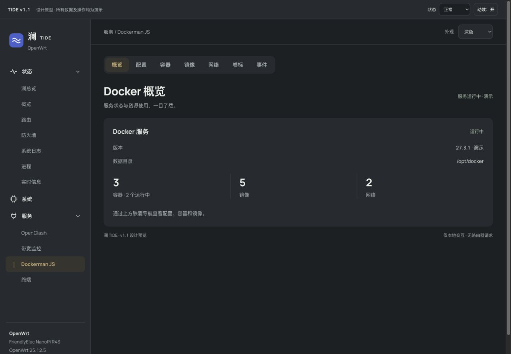
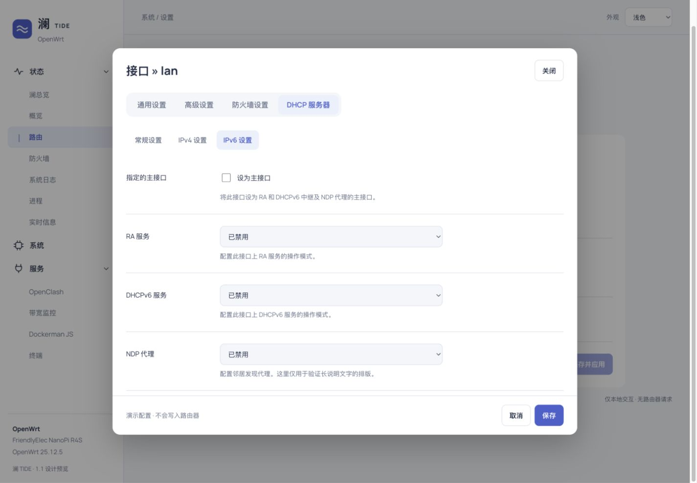
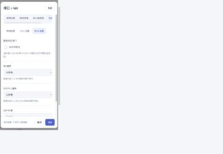

# 澜 TIDE v1.1 · 可读性、导航与配置布局设计

日期：2026-10-05。状态：用户已确认实施，已安装到 192.168.5.5 并完成总览及 DHCP/IPv6 实机检查。模式：Operate（路由器管理）。

本轮仅新增原型和设计文档，不修改 `htdocs/`、模板、安装包或路由器配置。v1.1 是设计版本，不是已发布软件版本。本文件补充 `TIDE-DESIGN.md`，不替换已经确认的 v1.0 规范。

## 设计依据与确认边界

用户已确认胶囊子导航，希望侧栏更宽、字体更大；要求先原型，再决定实施。保持 TIDE 的侧栏、海蓝浅色、石墨灰/琥珀深色和现有信息顺序。

证据是用户三张真实 LuCI 截图及当前 `cascade.css`、`compat.css`、`overview.js`、`tide.js`，不是旧演示原型里假定的能力。本轮没有操作线上 LuCI，也没有获取真实接口弹窗 DOM；因此弹窗故障原因仍是待验证假设。

原型：`refinement-v1.1/index.html`，配套 `prototype.css` / `prototype.js`。所有数值和保存操作都是本地演示，不执行网络请求；暂未制作的配置/插件内容会明确说明。字体复用 `docs/assets/manrope-latin.ttf`。

## 优先级与决策

| 优先级 | 当前表现/证据 | 提案 |
|---|---|---|
| P1 | 接口弹窗宽但内部字段窄，说明逐字换行；DHCP 二级导航竖堆 | 独立弹窗布局，两个水平导航层级；表单内容占可用宽度 |
| P1 | 侧栏 212px，≤1200px 为 183px，≤980px 为 155px；子菜单缩进占宽 | 桌面 256px，中屏 232px，≤820px 抽屉；一级 15px、子级 14px |
| P1 | 正文 13px，多处辅助文本 11px | 正文 14px，导航/重要操作 15px，说明 13px、图表时间刻度 12px |
| P1 | tab 灰方块、底线和主题样式混用 | 统一内容宽度胶囊；明确完整重置旧 tab 规则 |
| P2 | 右卡被同排高度拉伸；截图上下两个刷新入口 | 网格 `align-items:start`，卡片由内容决定高度；只留页面刷新工具组 |
| P2 | 图表有断采但没有解释；旧数据时效不够显著 | 区分零值、缺测、首次加载、过期、暂停 |
| P2 | 按钮粒子、450ms 页面入场、1000ms 重描曲线偏重 | 请求/导航/保存反馈优先，减去装饰循环与粒子 |

不通过添加不存在的 CPU 使用率或其他指标填满空白。平均负载不改名为 CPU 使用率，接口已连接不改为互联网正常；“无线关联设备”不改为全部设备。

## 布局与字号

尺寸都是 CSS px，不能从高分辨率截图按像素直接倍增。

| 元素 | 规格 |
|---|---|
| 侧栏 | >1200px：256px；821–1200px：232px；≤820px：抽屉 280px，最大 85vw |
| 侧栏内边距 | 桌面 28px 16px 20px；一级文字起点约 44px，子级文字起点 44px（相对含图标的一层形成层次） |
| 导航 | 一级 15px/500，子级 14px/400，选中 600；最小行高 44px |
| 顶栏 | 桌面 72px，手机 68px；上下文 14px、外观 13px |
| 内容 | 最大 1560px；桌面内边距 32px 36px，中屏 28px，手机 25px 18px |
| 网格 | 流量:网络系统为 1.75:1；右列最小 320px；≤1050px 单列；间距 24px，中屏 20px |
| 文字 | 正文/表单/表格 14px，说明/表头 13px，非关键刻度/页脚 12px |
| 标题 | 页面 32px/750，手机 28px；卡片 18px/700，状态标题 23px |
| 数值 | 34px/700，手机 28px；所有动态数值使用 tabular-nums |
| 卡片 | 圆角 14px，内边距 26px，中屏 22px，手机 21px；普通面板不加投影 |
| 控件 | 常规 44px 高、圆角 9px；焦点 2px 强调色，外移 4px |

单纯增大 body 不能覆盖原有组件字号。实施时必须分别检查菜单、单位、说明、表头、按钮和手机覆盖规则。长插件名在侧栏省略时应提供完整名称提示；长地址在内容区自然换行，不能把控件缩到单字宽。

## 胶囊导航

页面级：底槽按内容宽度、圆角 14px、内边距 5px，选中项圆角 10px。项高 40px、文字 15px、左右 18px；金色/海蓝文字加低对比选中底色，不使用整块高饱和强调色。底槽到标题间隔 28px（手机 24px）。

底槽不铺满页面，不等宽拉伸七个 Docker 入口。窄屏横向滚动，保留滚动条/右侧截断作为还有选项的线索；选中项自动进入可视区。页面本身不横向滚动。

真实路由入口保持链接与 `aria-current=page`，同页标签才使用 `tablist` / `tab` / `tabpanel` 和 roving tabindex。原型用按钮切换本地视图，方向键/Home/End 移焦、Enter/Space 选择。不可把这一行为直接替换 LuCI 原有路由/表单语义。

`compat.css` 的 `.tabs>li` 仍有 25px 高度，链接仍有旧 line-height/overflow；`.tabs>li:not(.active)` 的背景选择器特异性高于通用 reset。实施需完整重置 background/background-image、height、float、margin、border、line-height、链接圆角、white-space 和焦点样式，再建立状态，不通过不加区分的全局 `!important` 扫平插件。

## 接口弹窗与嵌套表单（本轮新增重点）

目标场景：接口 » lan → DHCP 服务器 → IPv6 设置，深浅主题均需成立。

- 弹窗宽 `min(960px, 100vw - 48px)`，高由内容决定，最大 `100dvh - 48px`。手机四周留 12px。
- 头部标题 24px（手机 21px），关闭按钮 44px；头尾固定，只有中间内容滚动。
- 一级胶囊：通用/高级/防火墙/DHCP；底槽使用工作区背景，区别于弹窗白色/深色面板。
- 二级分段：常规/IPv4/IPv6。14px、40px 高，选中淡底，其余无独立灰块。不套额外的窄边框卡片，不竖堆，不与一级同样重。
- 字段行 `170px minmax(0,1fr)`、间距 24px、上下 24px；标签和字段都是直接网格子项。手机上下排列。
- 字段容器 `min-width:0; width:100%`；控件最大 460px、说明最大 65ch。**只限制控件宽度，不限制字段容器/帮助文字的宽度。**
- 说明置于控件下方，13px/1.6、自然而有限地换行；错误紧随字段，不靠 tooltip 才能读到。
- 嵌套 `.cbi-value > .cbi-section` 等结构不能误当作标签/字段两列里的一个窄单元。实施须检查祖先 grid/flex、旧 float/width/max-width 和 nested section 的跨列规则。
- 帮助图标如保留，独占约 16px，旁边说明列 `minmax(0,1fr)`；不能让图标/说明成为多个争抢网格列的匿名子项。
- 底部取消/保存可见且不遮挡内容；焦点受 dialog 管理，Escape 关闭并回到触发按钮。真实脏数据遵循 LuCI 原有取消/关闭规则。

截图故障是确定的，但不能仅凭截图断定 `.cbi-value` 是唯一根因。正式修复前要在实际弹窗中测量各层宽度；原型验证设计布局，不是线上兼容修复证明。

## 总览与状态反馈

保持“网络状态 → 流量 → 网络/系统 → 设备”的扫描路径。资源卡采用自适应高度，避免无内容的拉伸；本原型保留一个网络/系统卡，若后续字段增加再考虑拆为两块。

- 页面标题旁一组暂停/刷新，顶栏只留上下文及外观，不重复放轮询按钮。
- 工具组显示最后成功更新时间；失败时明确“已过期，保留上次数据”，提供重试。
- 暂停只暂停采样；手动刷新仍可用，刷新后自动采样仍保持暂停。
- 缺测曲线断开且注明“暂无采样”；不得用连线或零值伪造连续数据。首次尚无足够采样显示收集中，真实零速率是 0。
- 图表指向/键盘聚焦有读数。原型是固定示例读数；正式版应对应时间点并提供可访问文本。
- 无无线硬件说明“未检测到无线接口”；设备空列表说明下一步，不用红色制造故障感。
- 长 IPv6 可换行；移动表格只在自身容器滚动，保留名称、地址、状态。

## 表单状态与交互

字段依次为标签、控件、帮助、错误；标签列 170px、输入最大 460px。表单底部使用正常文档流，不以悬浮按钮覆盖最后字段。

| 状态 | 表现/行为 |
|---|---|
| 未修改 | 保存 disabled，说明没有未保存的更改 |
| 修改中 | 明确未保存状态；失败保留用户输入 |
| 校验失败 | 字段错误、aria-invalid、焦点回错误字段 |
| 保存请求中 | 显示应用中、禁止重复提交；不暗示已成功 |
| 成功 | 明确已应用，再解除锁定；原型明确“未写入路由器” |
| 请求失败 | 错误和重试入口，恢复可编辑状态、保留输入；实施必须验证 |

原型为了可评审，在脏数据时阻止页面切换并提示先保存/撤销。正式版不引入与 LuCI 冲突的第二套拦截；必须复用原有草稿/应用行为。

## 颜色与可访问性

保持 v1.0 tokens：浅色背景 #f2f6fb、面板 #fff、文字 #172a43、强调 #245fce；深色背景 #1b2023、面板 #242b2f、文字 #ecefe9、强调 #e3b779。深色辅助文字由 #a6b0b2 微调到 #adb7ba。完整值见下方 CSS 附录。

正文、帮助、placeholder 目标对比度 ≥4.5:1；大字 ≥3:1。状态必须有文字，焦点不只改变颜色。输入保留原生选择器、复选框、键盘机制；装饰图标不替代文本标签。

## 动效规格

统一缓动 `cubic-bezier(.16,1,.3,1)`；无需等待动画完成才允许下一次操作。

| 组件 | 触发与规格 | 中断/减少动态效果 |
|---|---|---|
| 胶囊指示块 | 同页选择时 transform+width 200ms；文字颜色 150ms | 连续点击从当前视觉状态重新定位；路由初次加载直接选中；reduce 立即切换 |
| 菜单分组 | grid-template-rows 240ms，箭头 transform 240ms | 可反向展开/关闭；reduce 无动画 |
| 移动侧栏 | transform 260ms 进入/离开；遮罩即时出现 | 新操作可接续反向过渡；关闭恢复触发器焦点；reduce 即时 |
| 普通按钮 | 背景/颜色 150ms、按压 scale(.98) 120ms | 松手回原位；reduce 去掉缩放，状态色保留 |
| 同页内容 | opacity .5→1、translateY 4→0、160ms | 不做全页/每卡编排；新选择取消旧内容；reduce 即时可见 |
| 刷新 | 请求期间图标旋转 800ms linear loop | 请求结束立即停止；reduce 用更新中文字代替旋转 |
| 资源条 | scaleX 到实际占比 300ms | 高频新值从当前状态过渡；reduce 即时更新 |
| 详情抽屉 | 进入 260ms ease-out、退出 160ms ease-in，位移 24px | 关闭只执行一次；关闭后恢复焦点；reduce 即时 |
| 接口弹窗 | opacity .4→1、translate 8→0、220ms | 原型关闭即时；reduce 即时，焦点/文字状态保留 |
| 主题 | 本轮直接更换 tokens，不做全屏圆形揭幕 | 不影响表单状态；reduce 同样立即切换 |

移除按钮粒子、装饰性呼吸点、每次轮询的数字滚动/整图重描。只有真实加载期间有循环，不让静态内容依赖动画才能出现。后台标签页停止无意义视觉循环。

## 原型评审路径

1. 默认深色总览：看侧栏、说明字号、两列卡片的高度。
2. 侧栏 Dockerman JS：切概览/容器，查看七项胶囊；其他 tab 提供占位说明，不模拟不存在的管理能力。
3. 侧栏系统：修改主机名、留空后保存，查看错误/未保存；撤销后查看接口弹窗。
4. 接口弹窗：切换一级/二级导航，查看 DHCP → IPv6；浅色模式对照用户截图。
5. 顶部原型工具切缺测/失败/空列表；手机看菜单抽屉、横向胶囊与纵向字段。

截图：





## 验证记录与实施验收

本轮使用独立设计审视和源码/检测审视（Assessment A: design_review，B: source_review），再对新增原型进行浏览器检查。不是给生产系统打完整可访问性分数的审计。

- 原旧原型 detector：2 warning；静态呼吸点有效，骨架 shimmer 被称为 marquee 属规则名误报。
- 新原型 detector：1 warning（cramped-padding），来自统计栏分隔线旁的文本分组；没有背景盒子，实际有栏间间距，作为误报保留记录，不为消除告警添加装饰层。
- JS 语法检查通过；桌面及手机检查发现的 Docker 子内容误隐藏问题已修正。
- 浏览器检查 1440px 下侧栏为 256px；390px 下页面无横向溢出，容器表格仅局部滚动。
- 接口弹窗桌面字段区可用宽度 710px、说明实际约 515px；390px 视口弹窗 366px、字段约 315px，不逐字竖排。已查看深浅两种模式。
- 已验证主机名空值错误；手机菜单打开/关闭、胶囊选择及三行容器数据可见；本轮没有验证真实网络请求或保存恢复。
- 浏览器未注入 detector overlay；CLI 检测与真实渲染分别记录。临时 viewport 已恢复；保留本地预览服务供用户评审。

实施验收必须覆盖：真实 LuCI Overview/Network Interfaces/DHCP IPv6、Docker/OpenClash 等插件；正常/空/失败/旧数据/保存失败；深浅主题；390/820/1099/1440px 与 200% 缩放；键盘焦点、reduced-motion；动态字段、嵌套 section、列表表格、长插件名/IPv6 地址。真正安装到路由器后才可声称兼容。

待用户确认后再实施：主题 tokens 和 shell → 两类 tab → 嵌套表单/弹窗兼容 → 状态反馈与动效。每阶段保留现有 LuCI 业务逻辑，不直接拷贝本地演示 JS。

## 附录：可交接的具体 HTML/CSS

以下是核心结构，不依赖截图来推测排版。完整可编辑 HTML 为 `refinement-v1.1/index.html`，交互参考为 `prototype.js`，完整 CSS 原文附在后面。

```html
<nav class="pills" aria-label="接口设置">
  <span class="pill-indicator" aria-hidden="true"></span>
  <button>通用设置</button><button>高级设置</button>
  <button>防火墙设置</button><button aria-current="page">DHCP 服务器</button>
</nav>
<nav class="subtabs" aria-label="DHCP 设置">
  <button>常规设置</button><button>IPv4 设置</button>
  <button aria-current="page">IPv6 设置</button>
</nav>
<div class="field">
  <label for="ra">RA 服务</label>
  <div>
    <select id="ra"><option>已禁用</option></select>
    <small>配置此接口上 RA 服务的操作模式。</small>
  </div>
</div>
```

下面 CSS 是原型的完整视觉规格；LuCI 实施须映射现有 DOM，不能直接把演示 class 当作已完成兼容。

```css
@font-face{font-family:Manrope;src:url('../assets/manrope-latin.ttf') format('truetype');font-weight:200 800;font-display:swap}
:root{color-scheme:dark;--bg:#1b2023;--panel:#242b2f;--ink:#ecefe9;--muted:#adb7ba;--line:#3a4347;--accent:#e3b779;--soft:#37342e;--hero:#303532;--success:#a6c8ac;--error:#eea29a;--on-accent:#282521;--sidebar:256px;--ease:cubic-bezier(.16,1,.3,1)}
:root.light{color-scheme:light;--bg:#f2f6fb;--panel:#fff;--ink:#172a43;--muted:#5e7087;--line:#d6e0eb;--accent:#245fce;--soft:#e9f0fc;--hero:#dce9fa;--success:#217660;--error:#a7463d;--on-accent:#fff}
*{box-sizing:border-box}body{margin:0;background:var(--bg);color:var(--ink);font:14px/1.6 Manrope,-apple-system,BlinkMacSystemFont,"PingFang SC","Microsoft YaHei",sans-serif;font-variant-numeric:tabular-nums;-webkit-font-smoothing:antialiased}button,input,select{font:inherit}button,select{cursor:pointer}button{background:var(--panel);color:var(--ink);border:1px solid var(--line);border-radius:9px;min-height:44px;padding:9px 15px;font-weight:600;transition:background-color 150ms,color 150ms,transform 120ms}button:hover{background:var(--soft)}button:active{transform:scale(.98)}button:disabled{opacity:.55;cursor:default;transform:none}select,input:not([type=checkbox]){background:var(--bg);color:var(--ink);border:1px solid var(--line);border-radius:9px;padding:9px 12px;min-height:44px;max-width:100%;caret-color:var(--accent)}:focus-visible{outline:2px solid var(--accent);outline-offset:4px}::selection{background:var(--accent);color:var(--on-accent)}[hidden]{display:none!important}h1,h2,p{margin:0}h1{font-size:32px;line-height:1.3;font-weight:750;letter-spacing:-.025em}h2{font-size:18px;line-height:1.4;font-weight:700}small{font-size:13px;color:var(--muted)}.secondary-text{color:var(--muted)}.icon{width:21px;height:21px;fill:none;stroke:currentColor;stroke-width:1.7;stroke-linecap:round;stroke-linejoin:round;flex-shrink:0}.previewbar{min-height:54px;padding:7px 22px;background:var(--panel);border-bottom:1px solid var(--line);display:flex;align-items:center;justify-content:space-between;gap:14px}.previewbar strong{font-size:13px;letter-spacing:.05em}.preview-note{margin-left:16px;color:var(--muted);font-size:12px}.preview-controls{display:flex;align-items:center;gap:10px}.preview-controls label{font-size:12px;display:flex;gap:8px;align-items:center}.preview-controls select,.preview-controls button{font-size:12px;min-height:36px;padding:5px 9px}.shell{display:grid;grid-template-columns:var(--sidebar) minmax(0,1fr)}aside{position:sticky;top:0;height:100dvh;background:var(--panel);border-right:1px solid var(--line);padding:28px 16px 20px;display:flex;flex-direction:column;gap:30px;min-width:0}.brand{display:flex;align-items:center;gap:12px;padding:0 10px}.brand>svg{width:40px;height:40px;flex-shrink:0}.brand strong{font-size:25px}.brand strong span{font-size:12px;letter-spacing:.13em;margin-left:5px}.brand small{display:block;margin-top:3px}aside nav{overflow:auto;min-height:0;flex:1;scrollbar-width:thin;scrollbar-color:var(--line) transparent}.group{display:flex;align-items:center;gap:12px;width:100%;background:none;border:0;font-size:15px;font-weight:500;padding:10px 12px;margin:4px 0}.chevron{margin-left:auto;width:15px;transform:rotate(90deg);transition:transform 240ms var(--ease)}[aria-expanded=false] .chevron{transform:rotate(0)}.children{display:grid;grid-template-rows:1fr;transition:grid-template-rows 240ms var(--ease)}.children.collapsed{grid-template-rows:0fr}.children>div{min-height:0;overflow:hidden}.children button{display:block;width:100%;padding:10px 12px 10px 44px;text-align:left;min-height:44px;border:0;background:transparent;font-weight:400;color:var(--muted);position:relative}.children button:hover{background:var(--soft);color:var(--ink)}aside button[aria-current=page]{color:var(--accent);font-weight:600;background:var(--soft)}.children button[aria-current=page]:before{content:"";position:absolute;left:23px;top:16px;width:1px;height:16px;background:var(--accent)}.sidebar-bottom{padding:20px 10px 0;border-top:1px solid var(--line);font-size:13px}.sidebar-bottom>*{display:block}.sidebar-bottom span{color:var(--muted);margin-top:3px}.sidebar-bottom small{margin-top:15px;font-size:12px}.workspace{min-width:0}header{height:72px;padding:0 36px;border-bottom:1px solid var(--line);display:flex;justify-content:space-between;align-items:center;color:var(--muted);gap:16px}.appearance,.context{display:flex;align-items:center;gap:12px}.appearance{font-size:13px}.appearance select{background:var(--panel);min-height:40px;font-size:13px}main{max-width:1560px;margin:auto;padding:32px 36px}.heading{display:flex;justify-content:space-between;align-items:center;gap:24px;margin-bottom:24px}.heading p{color:var(--muted);margin-top:9px;max-width:70ch}.refresh-group{text-align:right;flex-shrink:0}.refresh-group>span{color:var(--muted);font-size:13px;display:block;margin-bottom:8px}.actions{display:flex;gap:8px;justify-content:flex-end;flex-wrap:wrap}.actions button{display:inline-flex;align-items:center;justify-content:center;gap:8px}.connection{padding:24px 28px;border-radius:14px;background:var(--hero);display:flex;justify-content:space-between;gap:24px;margin-bottom:24px}.connection-copy{display:flex;align-items:center;gap:18px}.connection-copy>.icon{width:30px;height:30px;color:var(--accent)}.connection h2{font-size:23px}.connection p{margin-top:7px;color:var(--muted);font-size:13px}.connection-stat{border-left:1px solid var(--line);padding-left:26px;min-width:145px;display:flex;flex-direction:column;justify-content:center}.connection-stat strong{font-size:28px}.connection-stat span{font-size:13px;color:var(--muted)}.overview-grid,.lower-grid{display:grid;grid-template-columns:minmax(0,1.75fr) minmax(320px,1fr);gap:24px;margin-bottom:24px;align-items:start}.panel{background:var(--panel);border-radius:14px;padding:26px;min-width:0}.panel-head{display:flex;justify-content:space-between;align-items:center;gap:12px;margin-bottom:22px}.panel-head select{font-size:13px;min-height:40px}.metrics{display:grid;grid-template-columns:repeat(3,minmax(0,1fr))}.metrics>div{padding:0 20px;border-right:1px solid var(--line);min-width:0}.metrics>div:first-child{padding-left:0}.metrics>div:last-child{border:0;padding-right:0}.metrics span{color:var(--muted)}.metrics p{font-size:13px;color:var(--muted);margin:4px 0}.metrics strong{font-size:34px;font-weight:700;color:var(--ink);line-height:1.3;margin-right:5px}.chart{position:relative;margin-top:25px;height:200px}.chart>svg{width:100%;height:100%;overflow:visible}.gridline{stroke:var(--line);stroke-width:1;stroke-dasharray:3 6;fill:none}.down,.up{fill:none;stroke:var(--accent);stroke-width:2.5;vector-effect:non-scaling-stroke;stroke-linejoin:round}.up{stroke:var(--muted);stroke-width:1.5}.axis{display:flex;justify-content:space-between;margin-top:14px;color:var(--muted);font-size:12px;gap:8px}.legend{display:flex;align-items:center;gap:20px;font-size:13px;color:var(--muted);margin-top:20px}.legend span{display:flex;align-items:center;gap:8px}.legend i{width:8px;height:8px;background:var(--accent);border-radius:50%}.legend i.secondary{background:var(--muted)}.legend .sample-note{margin-left:auto;font-size:12px}.chart-tip{position:absolute;top:15px;left:50%;transform:translateX(-50%);max-width:90%;border:1px solid var(--line);background:var(--panel);padding:8px 12px;border-radius:8px;font-size:12px;opacity:0;pointer-events:none;transition:opacity 150ms}.chart:hover .chart-tip,.chart:focus .chart-tip{opacity:1}.gap{position:absolute;inset:0 35%;background:var(--bg);display:grid;place-content:center;text-align:center;color:var(--muted);font-size:13px}.gap small{font-size:12px;max-width:15ch}.gap-mode .chart-tip{display:none}.gap-mode .down,.gap-mode .up{clip-path:polygon(0 0,35% 0,35% 100%,65% 100%,65% 0,100% 0,100% 100%,0 100%)}dl{margin:0}dl>div{display:grid;grid-template-columns:72px minmax(0,1fr);gap:16px;margin-bottom:15px}dt{color:var(--muted)}dd{margin:0;text-align:right;overflow-wrap:anywhere}.resources{border-top:1px solid var(--line);padding-top:22px;margin-top:22px}.resource{margin-bottom:20px}.resource:last-child{margin:0}.resource>div:first-child{display:flex;justify-content:space-between;gap:12px}.resource>small{font-size:12px}.meter{height:6px;margin-top:10px;border-radius:4px;background:var(--line);overflow:hidden}.meter>span{display:block;height:100%;background:var(--accent);width:100%;transform:scaleX(var(--value));transform-origin:left;transition:transform 300ms var(--ease)}.text-button{border:0;background:none;color:var(--accent);padding:4px 0;min-height:40px;font-weight:500;font-size:13px}.text-button:hover{background:none;text-decoration:underline;text-underline-offset:4px}.table-wrap{overflow:auto}table{width:100%;border-collapse:collapse;font-size:14px;text-align:left}th{font-size:13px;color:var(--muted);font-weight:500}td,th{padding:12px 10px;border-bottom:1px solid var(--line)}td:first-child,th:first-child{padding-left:0}td:last-child,th:last-child{text-align:right;padding-right:0}tbody tr:last-child td{border:0}td small{display:block}.device{color:var(--ink);font-size:14px;text-align:left;font-weight:600}.status{color:var(--success);font-size:13px}.wifi-empty{text-align:center;padding:15px 0 25px}.wifi-empty .icon{width:28px;height:28px;color:var(--muted)}.wifi-empty p{margin:10px 0 5px}.empty{padding:26px 0;color:var(--muted)}.pills{display:flex;position:relative;gap:2px;width:max-content;max-width:100%;overflow:auto;border-radius:14px;background:var(--panel);padding:5px;margin-bottom:28px;scrollbar-width:thin;scrollbar-color:var(--line) transparent}.pills>button{flex:0 0 auto;position:relative;z-index:1;white-space:nowrap;padding:8px 18px;min-height:40px;border:0;background:transparent;border-radius:10px;font-size:15px;font-weight:500;color:var(--muted)}.pills>button:hover{background:var(--soft)}.pills>button[aria-current=page]{color:var(--accent);font-weight:600}.pill-indicator{position:absolute;top:5px;left:0;height:40px;background:var(--soft);border-radius:10px;pointer-events:none;transition:transform 200ms var(--ease),width 200ms var(--ease)}.docker-summary{display:grid;grid-template-columns:repeat(3,1fr);gap:24px;margin:25px 0 30px}.docker-summary>div{border-right:1px solid var(--line)}.docker-summary>div:last-child{border:0}.docker-summary strong{font-size:30px;display:block}.docker-summary span{color:var(--muted)}.form-panel{max-width:1000px}.form-panel>p{margin:7px 0 12px}.field{display:grid;grid-template-columns:170px minmax(0,1fr);gap:24px;padding:24px 0;border-bottom:1px solid var(--line)}.field>label{padding-top:10px}.field input:not([type=checkbox]),.field select{width:100%;max-width:460px;font-size:14px}.field small{display:block;margin-top:8px}.checkbox-line{display:flex;align-items:center;gap:10px;min-height:44px}input[type=checkbox]{accent-color:var(--accent);width:18px;height:18px}.form-footer{display:flex;justify-content:space-between;align-items:center;gap:20px;padding-top:24px}.form-footer>span{color:var(--muted);font-size:13px}.primary{background:var(--accent);border-color:var(--accent);color:var(--on-accent)}.primary:hover{background:var(--accent);filter:brightness(1.07)}.error-text{color:var(--error);font-size:13px;margin-top:8px}[aria-invalid=true]{border-color:var(--error)!important}.notice{margin-bottom:20px;padding:14px 18px;background:var(--panel);border:1px solid var(--error);border-radius:10px;color:var(--error);font-size:14px}footer{display:flex;justify-content:space-between;gap:20px;flex-wrap:wrap;font-size:12px;color:var(--muted);padding:15px 0 0}.mobile{display:none}.skip{position:fixed;top:-100px;left:20px;z-index:30;padding:10px 18px;background:var(--accent);color:var(--on-accent);border-radius:8px}.skip:focus{top:10px}.sr-only{position:absolute;width:1px;height:1px;overflow:hidden;clip-path:inset(50%)}dialog{inset:0 0 0 auto;margin:0;width:390px;max-width:90vw;max-height:none;height:100dvh;border:0;background:var(--panel);color:var(--ink);padding:28px;box-shadow:-12px 0 45px #0003}dialog::backdrop{background:#0006}dialog[open]{animation:drawer-in 260ms var(--ease)}dialog.closing{animation:drawer-out 160ms ease-in forwards}.busy .icon{animation:spin 800ms linear infinite}.swapping{animation:content-in 160ms var(--ease)}@keyframes spin{to{transform:rotate(360deg)}}@keyframes drawer-in{from{transform:translateX(24px);opacity:.4}to{transform:none;opacity:1}}@keyframes drawer-out{to{transform:translateX(24px);opacity:0}}@keyframes content-in{from{opacity:.5;transform:translateY(4px)}to{opacity:1;transform:none}}
@media(max-width:1200px){:root{--sidebar:232px}main{padding:28px}header{padding:0 28px}.overview-grid,.lower-grid{gap:20px;grid-template-columns:minmax(0,1.5fr) minmax(300px,1fr)}.panel{padding:22px}.metrics>div{padding:0 12px}.metrics strong{font-size:30px}.metrics p{display:flex;align-items:baseline;flex-wrap:wrap;gap:4px}}
@media(max-width:1050px){.overview-grid,.lower-grid{grid-template-columns:1fr}.heading{align-items:flex-start}.refresh-group>span{max-width:175px}.connection-stat{min-width:110px}.legend .sample-note{margin-left:0}}
@media(max-width:820px){.shell{display:block}.mobile{display:block}.previewbar{align-items:flex-start;padding:10px 16px;flex-wrap:wrap}.preview-note{display:block;margin-left:0}.preview-controls{width:100%;justify-content:space-between}aside{position:fixed;top:0;left:0;width:280px;max-width:85vw;height:100dvh;z-index:12;transform:translateX(-100%);visibility:hidden;transition:transform 260ms var(--ease),visibility 0ms 260ms}aside.open{visibility:visible;transform:none;transition:transform 260ms var(--ease),visibility 0ms}aside .brand{padding:0;gap:9px}.close-menu{margin-left:auto;font-size:12px;padding:6px 10px}.scrim{position:fixed;inset:0;background:#0006;border:0;border-radius:0;z-index:11}.scrim:hover{background:#0006}header{padding:0 18px;height:68px}.appearance{gap:7px}.appearance select{width:102px}.context{gap:9px;font-size:13px}main{padding:25px 18px}.heading{flex-wrap:wrap;gap:18px}h1{font-size:28px}.refresh-group{display:flex;justify-content:space-between;align-items:center;gap:10px;width:100%;text-align:left}.refresh-group>span{max-width:none;margin:0;font-size:12px}.connection{padding:21px;gap:16px}.connection h2{font-size:20px}.connection-copy{gap:12px}.connection-stat{display:none}.panel{padding:21px}.metrics strong{font-size:28px}.metrics small{font-size:12px}.chart{height:170px}.legend{flex-wrap:wrap;gap:12px}.legend .sample-note{width:100%}.pills{margin-bottom:24px}.pills>button{padding:8px 16px}.field{grid-template-columns:1fr;gap:8px;padding:20px 0}.field>label{padding:0}.form-footer{align-items:flex-start;flex-direction:column}.form-footer .actions{width:100%}.docker-summary{gap:14px}table{min-width:350px}footer span{display:none}}
html.motion-off *,html.motion-off *::before,html.motion-off *::after{animation:none!important;transition:none!important;scroll-behavior:auto!important}@media(prefers-reduced-motion:reduce){*,*::before,*::after{animation:none!important;transition:none!important;scroll-behavior:auto!important}}

#interface-dialog{inset:50% auto auto 50%;transform:translate(-50%,-50%);width:min(960px,calc(100vw - 48px));max-width:none;height:auto;max-height:calc(100dvh - 48px);border-radius:16px;padding:0;box-shadow:0 20px 65px #0004;overflow:hidden}#interface-dialog[open]{display:flex;flex-direction:column;animation:modal-in 220ms var(--ease)}.interface-header{display:flex;align-items:center;justify-content:space-between;padding:24px 28px;gap:16px}.interface-header h2{font-size:24px}.interface-scroll{padding:0 28px 10px;overflow:auto;min-height:0}.interface-scroll .pills{margin-bottom:24px}.subtabs{display:flex;gap:6px;overflow:auto;margin-bottom:8px;max-width:100%;padding:4px}.subtabs button{white-space:nowrap;flex-shrink:0;border:0;background:none;font-size:14px;font-weight:500;color:var(--muted);min-height:40px;padding:8px 14px}.subtabs button[aria-current=page]{background:var(--soft);color:var(--accent);font-weight:600}.interface-scroll .field{grid-template-columns:170px minmax(0,1fr)}.interface-scroll .field>div{min-width:0;width:100%}.interface-scroll .field small{max-width:65ch;white-space:normal;overflow-wrap:break-word;line-height:1.6}.interface-footer{display:flex;justify-content:space-between;align-items:center;padding:18px 28px;gap:16px;border-top:1px solid var(--line);background:var(--panel)}.interface-footer>span{font-size:13px;color:var(--muted)}@keyframes modal-in{from{opacity:.4;translate:0 8px}to{opacity:1;translate:0 0}}@media(max-width:820px){#interface-dialog{width:calc(100vw - 24px);max-height:calc(100dvh - 24px)}.interface-header{padding:18px}.interface-scroll{padding:0 18px 10px}.interface-scroll .field{grid-template-columns:1fr;gap:8px}.interface-footer{padding:16px 18px;flex-wrap:wrap}.interface-header h2{font-size:21px}.interface-scroll .pills>button{font-size:14px;padding:8px 14px}}

.interface-scroll .pills{background:var(--bg)}

```

## 实施记录 · 2026-10-05

已按原型修改 cascade.css / tide.js / overview.js，并补齐新增状态文案的中文翻译。嵌套 SectionValue 的 section 跨越整个表单网格；原有 LuCI tab、保存和路由处理保持不变。页面中只隐藏总览重复的 poll-status 指示器，保留其他原生提示。

本地验证使用原生 ucode 渲染主题模板、官方 LuCI DOM helpers 和合成 RPC；新增 DHCP/IPv6 嵌套表单 fixture。已覆盖 320–1920px、明暗主题、未保存输入保留、焦点、刷新失败、权限受限及动画关闭。浏览器截图与测试输出在本地 test-results/，属于合成数据验证，不能替代路由器上的插件兼容验收。实现阶段未制作新版 APK；后续按用户指示进行了现有安装的文件更新。

## 安装记录 · 2026-10-05

在 OpenWrt 25.12.5 / FriendlyElec NanoPi R4S（192.168.5.5）更新现有 Tide 安装并启用主题。更新 cascade.css、tide.js、overview.js、中文 LMO 和 header/footer 模板；文件哈希校验通过。补充 refinement-20261005 资源缓存标记，确保旧浏览器会加载新样式和模块。APK 数据库仍为 1.0.0-r1，本轮不宣称已发布新包。

回退备份位于路由器 `/root/tide-backups/refinement-20261005-014430/`：`before.tar.gz` 包含安装前四个资源及 luci 配置，`templates-before.tar.gz` 包含安装前 header/footer 模板。仅更新主题及外观配置，没有保存或应用网络配置。

实机总览显示中文最后更新时间；1099px 浏览器侧栏为中屏规格 232px。实际 LAN → DHCP 服务器 → IPv6 设置的字段区为 637px、说明约 515px，页面无横向溢出。安装截图保存在本地 `test-results/interface-router-installed.png`（不提交真实路由器截图）。更改、原型、文档及测试随本次用户授权的 commit/push 推送 main。
